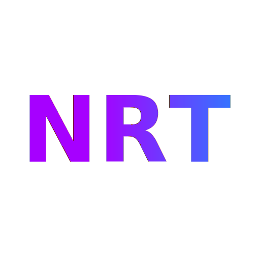
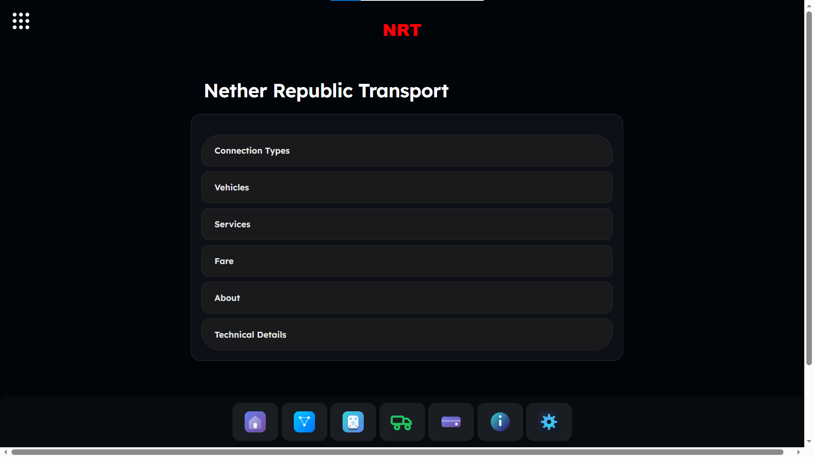
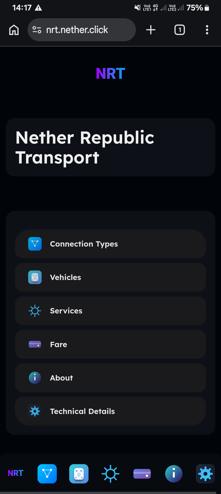

<h1>Nether Republic Transport</h1>
<br>
<a href="https://nrt.nether.click">🌐 Visit Official Website</a>

<h2>🚀 Project Overview</h2>
<p>Nether Republic Transport (NRT) is a fictional transportation system founded in november 2024.<p>

<h2>📸 Preview (Screenshots)</h2>



<h2>🛠️ Technologies Used</h2>


<span>HTML5</span>


<span>CSS3</span>


<span>JavaScript</span>


<span>Nether.js</span>
<h2>💻 How to Try It on Your PC</h2>

### 1. Clone the repository
```bash
git clone https://github.com/dqnx19/nrt.git
```

### 2. Run Server
```bash
python -m http.server 8000
```

### 3. Open your browser
```bash
http://localhost:8000
```