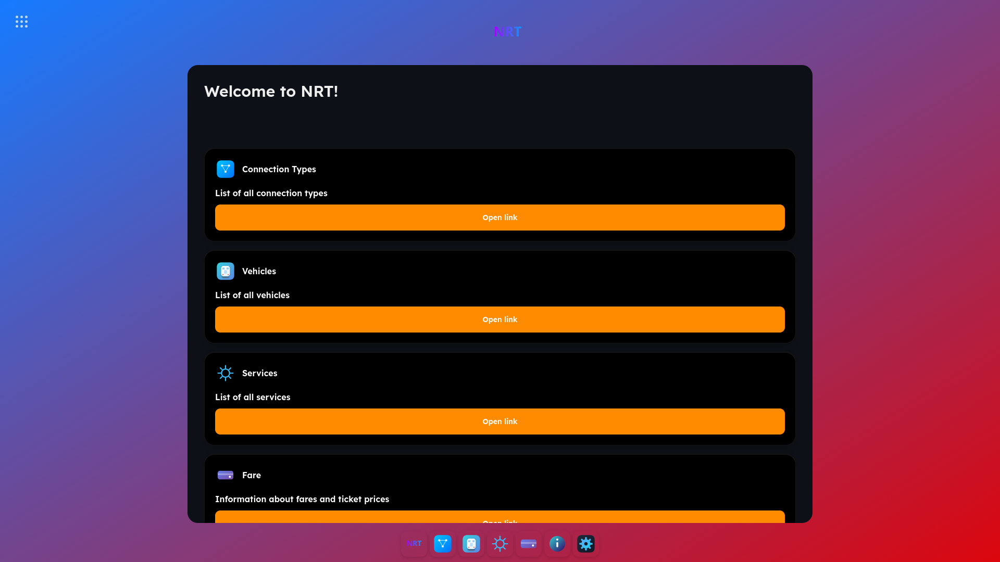

# Nether Republic Transport

## Project Overview
- Fictional transportation system
- Created in November 2024


## Preview (Screenshots)


## Used Technologies

<span>HTML5</span>
<br>

<span>CSS3</span>
<br>

<span>JavaScript</span>
<br>

<span>Nether.js</span>

## Requirements
- Git
- Node.js
- 

## How to Try It on Your PC
```bash
git clone https://github.com/dqnx19/nrt.git
cd nrt
npm init
npm install express better-sqlite3 bcryptjs --no-bin-links
firefox http://localhost:5000
```
